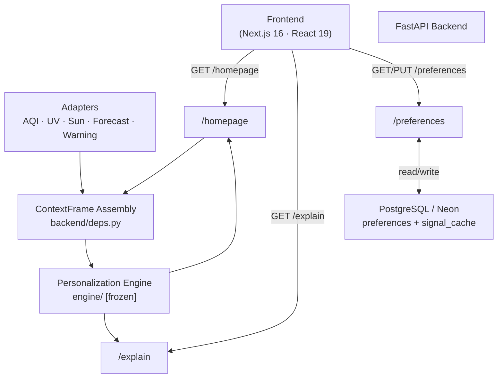

# Mausam — Personalized Homepage Engine

**SIH 2026 · Problem Statement SIH26076**
Ministry of Earth Sciences / India Meteorological Department · Theme: Smart Automation

---

## Problem

The Mausam mobile application shows the same generic weather homepage to every user. A parent planning a school commute, a runner planning a morning workout, and a person with asthma all see the same cards in the same order — even when the most important information for each of them is completely different.

## Our Solution

A **contextual relevance and priority engine** that produces a personalized, ranked homepage for each user by combining:

- Real and simulated weather/environment signals (AQI, UV, rain probability, wind, sunrise/sunset, severe warnings)
- User persona and optional health flags
- Time-of-day context (commute window, daylight hours)

The same underlying weather data produces *different card orders and different alerts* for different users — transparently, with an audit trail showing exactly which signal values drove each ranking decision.

> **This is not a replacement Mausam weather app.**
> It is an intelligent personalization layer that sits between raw meteorological data and the app's homepage UI.

---

## Personalization Example

**Weather state:** AQI 165 (Poor) · UV 9 (Very High) · Rain 55% probability · No active warning

| Persona | Top Card | Explanation |
|---|---|---|
| Health-conscious (asthma) | **AQI Alert — P1** | AQI 165 × respiratory flag → 1.8× urgency threshold |
| Outdoor fitness | **UV Warning — P1** | UV 9 (Very High) + outdoor relevance → 1.8× urgency |
| Parent / family | **Rain Alert — P1** | 55% rain within commute window → high family relevance |

Same weather. Three genuinely different homepages.

---

## Key Features

| Feature | Status |
|---|---|
| Contextual ranking engine (score = persona × urgency × confidence) | ✅ Complete |
| P0 hard-rule override for severe weather warnings | ✅ Complete |
| AQI signal (CPCB fixture; live adapter scaffold present) | ✅ Complete |
| UV index signal (fixture; live adapter scaffold present) | ✅ Complete |
| Rain / precipitation probability signal | ✅ Complete |
| Sunrise/sunset (live computed, no API required) | ✅ Complete |
| Temperature, humidity, wind signals | ✅ Complete |
| IMD-shaped severe warning fixture scenarios | ✅ Complete |
| Pollen (engine card present; fixture adapter pending) | ⚠️ Skeleton |
| User preferences — device-scoped persona + health flags | ✅ Complete |
| Explainability: `/explain` API traces every card to actual signal values | ✅ Complete |
| Degraded-data handling: `source: "unavailable"` propagation + `system_notice` | ✅ Complete |
| PostgreSQL persistence for preferences (Neon-compatible) | ✅ Complete |
| Frontend personalized homepage UI | 🔲 Next milestone |

---

## Supported Personas (Current MVP)

The current implementation deeply supports **three personas** with dedicated scoring weights, urgency bands, and card prioritization:

1. **Health-conscious users** — AQI, UV, pollen (simulated), humidity guidance
2. **Outdoor fitness enthusiasts** — activity window, sunrise/sunset, wind, heat alert, UV
3. **Parents & families** — rain commute alert, commute-window detection, severe warnings

> **Regarding the remaining official PS personas:**
> Beachgoers & surfers, Travelers, Agriculture & gardeners, Commuters (traffic), and Event planners were deliberately deferred to future expansion rounds (see [Decision D4](docs/planning/00_project_decision_log.md)). The engine architecture — one card definition + scoring rule per persona/signal — is designed so adding a new persona is a data/rule-table addition, not an architecture change.

**Cold-start:** a user with no preferences set gets an immediate, sensible, safety-first homepage (Severe Warning > General Conditions > AQI/UV at moderate default weight). No login or setup required.

---

## How It Works

```
Data Adapters (AQI, UV, Forecast, Warning, Sun)
    └─→ Context Assembly (ContextFrame per request)
           └─→ Personalization Engine [frozen, pure function]
                  └─→ Ranked Cards + Explanations
                         └─→ /homepage API
                                └─→ Frontend (renders returned order — never re-ranks)
```

The **frontend always renders the backend's card order**. Personalization logic lives exclusively in the engine — this is what makes the explanation layer auditable: every rank decision is traceable to the exact signal values that drove it.

---

## Architecture



> The engine (`engine/`) is a frozen pure function: `ContextFrame → (RankedCards, Explanations)`. It has no network or database calls. It is not modified during Phase 2A or 2B and will not be modified during frontend integration.

---

## Technology Stack

| Layer | Technology |
|---|---|
| Frontend | Next.js 16, React 19, TypeScript, Tailwind CSS v4, TanStack Query v5, Lucide React |
| Backend | FastAPI 0.115, Python, Uvicorn |
| Validation | Pydantic v2 |
| Database | PostgreSQL (Neon-compatible), psycopg v3 (native driver + pool) |
| Astronomy | `astral` 3.2 (sunrise/sunset — no API dependency) |
| Testing | pytest 8.3, httpx 0.27 (backend + engine) |
| HTTP client | `requests` 2.32 (adapter live-mode calls) |

---

## Project Structure

```
mausam-personalized-homepage/
├── engine/                  # Frozen personalization engine (pure function, no I/O)
│   ├── cards.py             # Card registry: 8 MVP card definitions
│   ├── scoring.py           # persona_weight × urgency_multiplier × confidence_factor
│   ├── priority.py          # P0–P3 classification + alert-floor rules
│   ├── engine.py            # rank() entry point → EngineOutput
│   ├── explain.py           # Templated explanation generator (8 templates)
│   ├── models.py            # ContextFrame, RankedCard, EngineOutput dataclasses
│   └── tests/               # 134 engine unit + scenario tests
│
├── adapters/                # Data source adapters (common BaseAdapter interface)
│   ├── base.py              # BaseAdapter: make_unavailable_signal()
│   ├── forecast_adapter.py  # Temp/humidity/wind/precip (fixture-mode)
│   ├── warning_adapter.py   # IMD-shaped warning fixtures
│   ├── aqi_adapter.py       # AQI (fixture now; live scaffold present)
│   ├── uv_adapter.py        # UV index (fixture now; live scaffold present)
│   ├── sun_adapter.py       # Sunrise/sunset (live computed via astral)
│   └── fixtures/            # IMD-shaped JSON fixture scenarios
│
├── backend/                 # FastAPI application
│   ├── main.py              # App factory, CORS, lifespan (DB pool init)
│   ├── deps.py              # build_context_frame() — ContextFrame assembly
│   ├── db.py                # PostgreSQL connection pool (psycopg v3)
│   ├── settings.py          # Environment settings (DATABASE_URL, CORS, etc.)
│   ├── models_api.py        # Pydantic response models (HomepageResponse, etc.)
│   ├── routers/
│   │   ├── homepage.py      # GET /homepage
│   │   ├── explain.py       # GET /explain
│   │   └── preferences.py   # GET/PUT /preferences
│   └── tests/               # 13 backend API tests
│
├── cache/
│   └── store.py             # Signal cache (PostgreSQL-backed, TTL-aware)
│
├── frontend/                # Next.js 16 frontend (scaffold — not yet implemented)
│   └── src/app/
│       ├── layout.tsx       # Root layout (Next.js App Router)
│       └── page.tsx         # Placeholder — homepage UI to be built here
│
├── docs/
│   ├── project_status.md    # ← Current project state (read this first)
│   ├── frontend_handoff.md  # ← Frontend developer guide
│   └── planning/            # Historical planning documents (preserved as-is)
│       ├── 03_personalization_logic_and_decision_matrix.md
│       ├── 06_system_architecture.md
│       ├── 07_api_and_data_contracts.md
│       ├── 08_data_source_and_integration_plan.md
│       ├── 09_ux_ui_specification.md
│       ├── 12_demo_and_judging_narrative.md
│       └── 13_final_mvp_specification.md
│
├── check_boundaries.py      # Production boundary checker (import/secret guards)
└── requirements.txt         # Python dependencies
```

---

## API Surface

| Endpoint | Method | Description |
|---|---|---|
| `/homepage` | GET | Returns personalized ranked card list for a device + location |
| `/explain` | GET | Returns explanation for a specific card (why it was ranked) |
| `/preferences` | GET | Returns stored persona + health flags for a device |
| `/preferences` | PUT | Updates stored persona + health flags |
| `/health` | GET | Backend + database health check |

**Query parameters for `/homepage`:** `device_id` (required), `lat` (required), `lon` (required)

See [API contracts](docs/planning/07_api_and_data_contracts.md) for full request/response schemas and invariants.

---

## Current Development Status

| Milestone | Status | Git ref |
|---|---|---|
| Architecture baseline | ✅ Complete | `9d471ba` |
| Phase 2A — PostgreSQL foundation + preferences API | ✅ Complete | `512a580` |
| Phase 2B — fixture adapters + personalized homepage API | ✅ Complete | `128d1aa` |
| **Frontend — personalized homepage UI** | **🔲 Next milestone** | — |
| 3-persona MVP (health, fitness, family) — backend | ✅ Fully supported | — |
| Remaining 5 official PS personas | 🔲 Future expansion | — |
| Live AQI / UV adapter hardening | 🔲 Future / pre-production | — |

See [docs/project_status.md](docs/project_status.md) for the detailed current state.

---

## Official PS Coverage (SIH26076)

| Requirement | Status |
|---|---|
| Personalized homepage — core architecture | ✅ Implemented (backend + engine) |
| Health-conscious persona | ✅ Deeply supported |
| Outdoor fitness persona | ✅ Deeply supported |
| Parents & families persona | ✅ Deeply supported |
| Explainability ("why this card") | ✅ Implemented |
| Cold-start (no profile → sensible default) | ✅ Implemented |
| Degraded data handling | ✅ Implemented |
| Beachgoer, Traveler, Agriculture, Commuter (traffic), Event planner personas | 🔲 Future expansion |
| Frontend UI (any screen) | 🔲 Next milestone |

---

## Running the Project

### Backend

```bash
# From repo root
python -m venv .venv
.venv\Scripts\activate          # Windows
pip install -r requirements.txt

# Set environment (see docs/planning/16_production_architecture_reassessment.md for full config)
$env:DATABASE_URL = "postgresql://..."    # Neon or local PostgreSQL DSN
$env:ADAPTER_MODE = "fixture"            # "fixture" (default) or "live"

# Run API
uvicorn backend.main:app --reload
```

### Frontend

```bash
cd frontend
npm install
npm run dev                     # Starts Next.js dev server at http://localhost:3000
```

> The frontend currently renders the default Next.js boilerplate. The Mausam homepage UI is the next implementation milestone — see [docs/frontend_handoff.md](docs/frontend_handoff.md).

---

## Testing

```bash
# Engine tests (134 tests)
python -m pytest engine/tests -q

# Backend API tests (13 tests)
python -m pytest backend/tests -v

# Production boundary check (import guards + no secrets in production files)
python check_boundaries.py
```

---

## Roadmap

1. **[Next] Frontend personalized homepage** — S2: render ranked cards from `/homepage` API
2. **[Next] Preferences/persona UI** — S4: GET/PUT `/preferences`, live reorder on change
3. **[Next] Explanation sheet** — S3: render `/explain` response ("why is this shown?")
4. **[Near-term] End-to-end integration test** — full demo scenario from persona change to visible reorder
5. **[Future] Targeted persona expansion** — comfort index (event planners), marine fixture card (beachgoers), extended forecast shape
6. **[Future] Live adapter hardening** — AQI/UV timeouts, retries, parse guards (per `docs/planning/16_production_architecture_reassessment.md`)
7. **[Future] Production deployment** — Render (backend) + Neon (PostgreSQL)

---

## Team Handoff Notes

**Frontend developer →** See [docs/frontend_handoff.md](docs/frontend_handoff.md). The personalization engine is complete and running. You consume ranked API results — you do not implement any ranking logic in the UI.

**Presentation/PPT team →** The key innovation is: *same weather context, transparently different homepage for different users, with every decision traceable to real signal values.* Not ML. Not a persona template. A rule + scoring engine that makes the "why" visible. See [docs/planning/12_demo_and_judging_narrative.md](docs/planning/12_demo_and_judging_narrative.md) for the exact demo script and prepared judge Q&A.

**Engine team →** `engine/` is frozen. Do not modify. All changes go through adapter extensions or new card definitions — adding a card requires only an entry in `engine/cards.py`, `engine/scoring.py`, `engine/explain.py`, and a corresponding test.