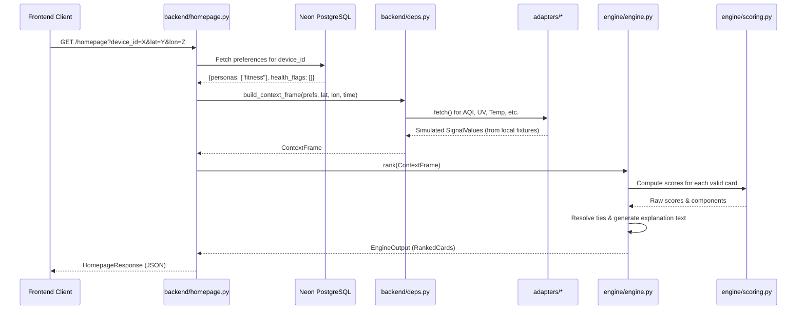

# 03: ENGINE AND PERSONALIZATION AUDIT

## 1. Current Personalization Model (Strict Deterministic)
The existing personalization in `mausam-personalized-homepage` is **100% Rule-Based and Configurable Weighting**, not ML. 

**Flow:**
1. **Inputs:** User personas, health flags, location, timezone (all assembled into `ContextFrame`).
2. **Card Applicability (`cards.py`):** Checks if required signals (e.g., AQI, UV) exist.
3. **P0 Overrides (`scoring.py`):** If `severe_warning` exists, it bypasses scoring entirely.
4. **Scoring (`scoring.py`):**
   `Score = Persona Weight × Urgency Multiplier × Confidence Factor`
    - *Persona Weight:* Looked up from `PERSONA_WEIGHT` dict (e.g., family+commute = 0.95).
    - *Urgency Multiplier:* Purely environmental functions (e.g., AQI > 150 = 1.8 urgency). Never reads persona.
    - *Confidence Factor:* 1.0 (live) down to 0.0 (unavailable).
5. **Conflict Resolution (`conflict.py`):** Sorts by score, resolves ties based on defined static ordering.
6. **Explanation (`explain.py`):** Generates static templated text tracing back to exact evidence without hallucinations.

## 2. Is this Machine Learning?
**ABSOLUTELY NOT.** 
- There are no ML libraries (`sklearn`, `pandas`, `xgboost`, `torch`).
- Weights are manually hardcoded in `engine/scoring.py`.
- No historical data is used to adjust weights.

## 3. End-to-End Execution Flow (Mermaid)

## 4. Persona Matrix: The Actual Truth
The SIH 26076 requirement calls for **8 personas**. The codebase currently only supports **3**.

| Persona | In UI? | In DB? | Engine Rules in `scoring.py`? | Tests? | Status |
|---|---|---|---|---|---|
| Health | Yes | Yes | Yes (0.9 wgt on AQI) | Yes | PARTIAL |
| Fitness | Yes | Yes | Yes (0.95 Activity Window) | Yes | PARTIAL |
| Family | Yes | Yes | Yes (0.95 Commute) | Yes | PARTIAL |
| Default | Implicit | Implicit | Yes (General conditions priority) | Yes | COMPLETE |
| Agriculture | No | No | No | No | **MISSING** |
| Commuter | No | No | No | No | **MISSING** |
| Beachgoer | No | No | No | No | **MISSING** |
| Travel | No | No | No | No | **MISSING** |
| Event Planner| No | No | No | No | **MISSING** |

They are simply array strings in a PostgreSQL `TEXT` column (`["health"]`).
