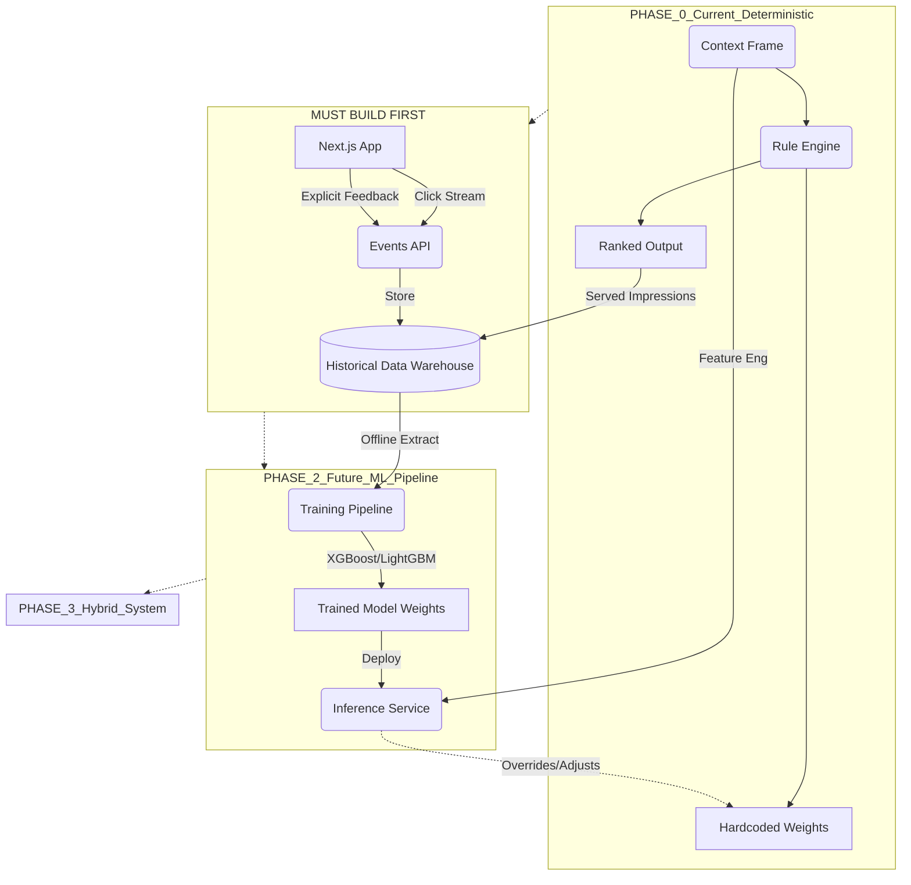

# 05: ML AND AI READINESS AUDIT

## 1. Strict Evidence-Based Verdict
**VERDICT: 0% MACHINE LEARNING IMPLEMENTED**

**Reasoning:**
- The repository was grepped for `sklearn`, `torch`, `keras`, `xgboost`, `pickle`, `pandas`, `catboost`. **0 results.**
- The "personalization engine" (`engine/scoring.py`) calculates heuristic scores using a hardcoded weight dictionary. 
- No historical interaction storage exists (no event logs of users clicking "useful" or "not useful"). 

## 2. Does this NEED Machine Learning immediately?
**NO.** The current deterministic rules are 100% correct for a hackathon MVP. Machine Learning is practically impossible right now because there is NO TRAINING DATA and NO LIVE USERS.

## 3. ML Evolution / Data Flow Diagram (The Realistic Path to AI)


## 4. What MUST be collected for Future ML?
To graduate from deterministic parsing to machine learning, you must start logging this JSON row for *every user session*:
```json
{
  "timestamp": "2026-08-28...",
  "user_firebase_id": "...",
  "personas_active": ["health"],
  "environment_state": {"aqi": 120, "uv": 5, "temp": 30},
  "shown_cards_ordered": ["aqi_health", "uv_sun_exposure"],
  "interacted_cards": ["aqi_health"],
  "time_spent_on_app_sec": 12
}
```
Until this dataset hits 10,000+ rows, ML is not viable.
