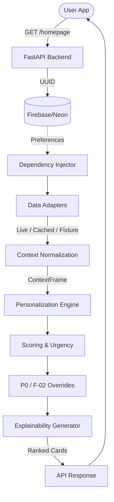
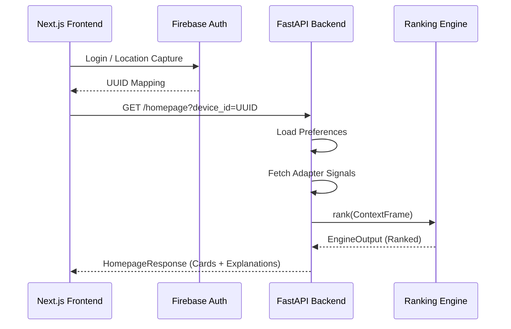
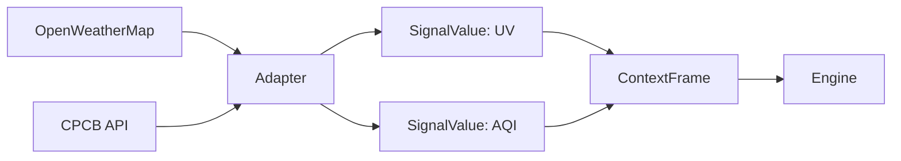
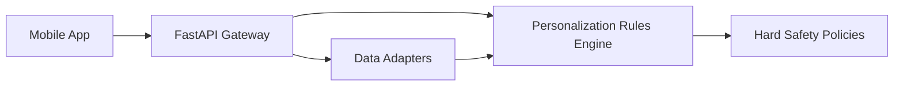
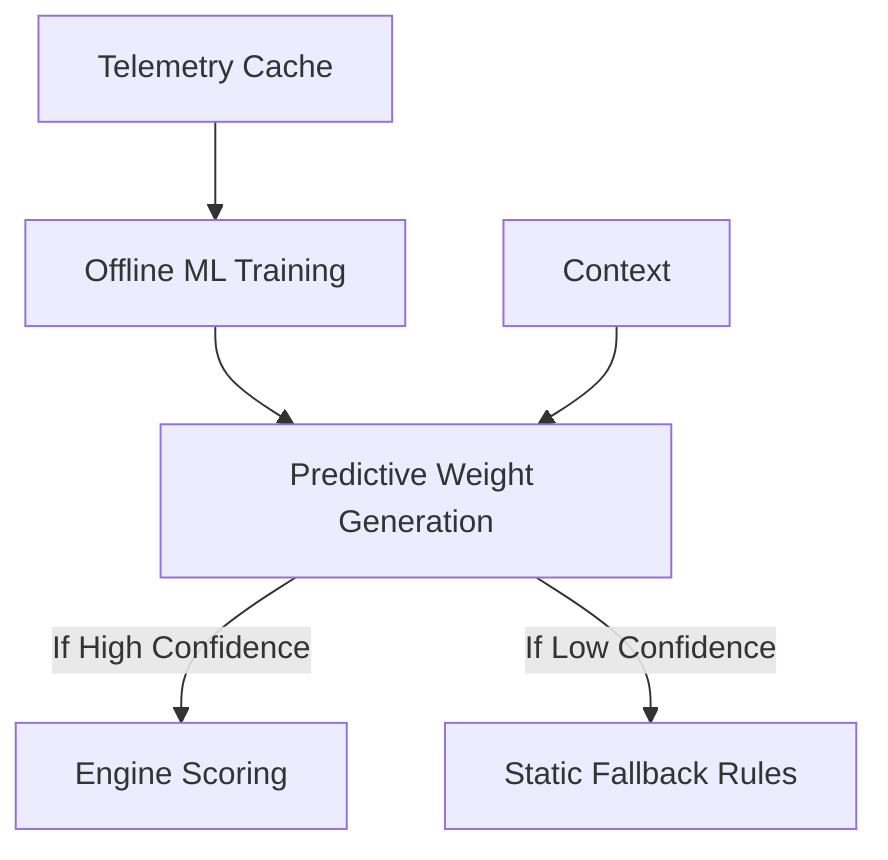

# MAUSAM MASTER SYSTEM KNOWLEDGE BASE
*Problem Statement: SIH26076 — Development of personalized homepage for 'Mausam' mobile application (MoES / IMD).*

---

## SECTION 1 — EXECUTIVE PROJECT UNDERSTANDING

### The Problem
The India Meteorological Department (IMD) aggregates massive amounts of weather data. Currently, traditional weather apps force every user to look at the exact same dashboard—a farmer sees the same radar as a commuter, and an asthmatic sees the same generic temperature as a surfer. A single generic homepage cannot effectively communicate safety and lifestyle priorities to a diverse population.

### The Solution: Personalized Homepage
This project builds a **context-aware personalized homepage**. It doesn't just display weather data; it **prioritizes** it using a dynamic, deterministic engine. "Smart Automation" here means automatically computing which 4-5 environmental insights (AQI, UV, Rain, Activities) matter most to the current user *at this exact minute*, based on their chosen Persona (e.g. Health vs Fitness), current location, and real-time environmental thresholds.

* **One-Sentence Project Explanation:** A smart backend engine that dynamically ranks and explains IMD weather data cards based on user personas, environmental urgency, and hard safety floors, ensuring every user sees the most critical weather insight for them instantly.
* **One-Minute Judge Explanation:** "Our personalization engine runs deterministically across 8 SIH personas. Instead of throwing raw data at users, it calculates an 'urgency multiplier' against their persona's base weights. If you are a 'Fitness' persona, you see outdoor activity windows first. But if the AQI breaches 300, our F-02 safety-floor overrides personalization completely, pushing Health warnings to the top. We achieve Smart Automation via rigorous cross-signal reasoning, not opaque AI, ensuring every warning is 100% auditable and explainable."

---

## SECTION 2 — FINAL PRODUCT VISION

The final product is a production-ready API and UI where a user's homepage layout is deeply dynamic, yet fully deterministic and predictable.

| Capability | Current (MVP) | Planned Final Product |
| :--- | :--- | :--- |
| **Personas Supported** | 2.5 (Health, Fitness, Family) | All 8 PS Personas |
| **Data Sources** | Fixture-based (AQI, UV, Warning, Forecast) | Live APIs (OWM, data.gov, INCOIS*) with Cache Fallback |
| **Device Identity** | Firebase UID / UUIDv4 passed locally | Fully Authenticated User Profiles |
| **Ranking Logic** | Isolated rules per card | Cross-Signal Reasoning (e.g., Heat + Poor AQI = new insight) |
| **Health Conditions**| Stored in API, currently inert | Modifies scoring multipliers proactively (Phase 2) |
| **Saved Locations** | Stored in API, currently inert | Triggers Traveler destination-alerts (Phase 3) |
| **Telemtry/ML** | None | Interaction logging leading to hybrid ML-ranked weights |

---

## SECTION 3 — ALL 8 FINAL PERSONAS

The system is rigorously designed around 8 core Personas. The Engine distinguishes rankings natively by scaling `urgency_multipliers` against these baseline `PERSONA_WEIGHT` values.

| Persona | Definition & Priority | Current Status | Roadmap Completion |
| :--- | :--- | :--- | :--- |
| **Health-conscious** | Focuses on respiratory/heat safety. Prioritizes `aqi_health` and `uv_sun_exposure`. Overrides normal cards when AQI > 150. | [CURRENTLY IMPLEMENTED] | Phase 2 applies explicit health_flags. |
| **Fitness** | Outdoor athletes. Prioritizes `activity_window`, sunrise/sunset. | [CURRENTLY IMPLEMENTED] | N/A |
| **Family** | Parents planning school/commute safety. Prioritizes `rain_commute`. | [CURRENTLY IMPLEMENTED] | N/A |
| **Traveler** | Users checking destination weather. Prioritizes destination alerts, packing suggestions. | [PLANNED] | Phase 3 integrates `saved_locations` warnings. |
| **Commuter** | Daily transit. Prioritizes visibility (fog) and severe storms. | [PLANNED] | Phase 3 introduces Visibility signals. |
| **Agriculture/Gardeners**| Farmers requiring soil moisture and frost insights. | [PLANNED] | Phase 4 adds proxy soil logic. |
| **Beachgoers** | Coastal users needing marine signals. | [PLANNED] | Phase 4 (if data source verifiable). |
| **Event Planners** | Need extended multi-day outlooks and comfort indices. | [PLANNED] | Phase 4 introduces `comfort_index`. |

**Example of Personalization Differential:**  
*Context:* Temp 22C, AQI 50, Rain 0%, UV 3. (Perfectly mild weather).
- *Health Persona sees:* **AQI Health** (Because AQI is their highest baseline interest).
- *Fitness Persona sees:* **Activity Window** (Because conditions are perfect for outdoor exercise).
- *Family Persona sees:* **Rain Commute** (Because commute planning is their primary baseline).

---

## SECTION 4 — COMPLETE SYSTEM ARCHITECTURE

**[CURRENTLY IMPLEMENTED]**: The core pipeline from API to Engine routing. Adapters operate via Fixtures (Phase 0).
**[PLANNED]**: Neon Database migration, interaction telemetry (Phase 7), and Live API hooks with Caching (Phase 5).

---

## SECTION 5 — FRONTEND TO BACKEND FLOW

The frontend operates a Next.js `App Router` scaffold structurally coupled to Firebase Identity (UUIDs mapping to API calls).

---

## SECTION 6 — BACKEND DEEP DIVE

FastAPI orchestrates execution rapidly through strict Pydantic schemas.

* **`main.py`**: API Entrypoint. Mounts routers and handles CORS.
* **`routers/homepage.py`**: Primary GET. Injects context, fires engine, formats Pydantic `HomepageResponse`.
* **`routers/preferences.py`**: Validates UUIDs and Enums; persists `health_flags`/`saved_locations`.
* **`deps.py`**: Dependency Injection. Hydrates the `ContextFrame` by invoking the `Adapters`.
* **`models_api.py`**: Strict Schema bounds preventing arbitrary data ingestion.

| Endpoint | Input | Main Processing | Current Status |
| :--- | :--- | :--- | :--- |
| `GET /homepage` | UUID, lat, lon | Hydrates ContextFrame, executes `engine.rank()`. | [COMPLETED IN PHASE 0] |
| `GET /explain` | UUID, card_id | Retrieves explanation delta templates. | [COMPLETED IN PHASE 0] |
| `PUT /preferences`| JSON (personas, flags)| Mutates DB schema logic. | [COMPLETED IN PHASE 0] |
| `POST /telemetry` | Batched events | Logs impressions. | [NOT YET IMPLEMENTED] |

---

## SECTION 7 — DATA ADAPTER ARCHITECTURE

Adapters are crucial. They shield the Engine from brittle third-party data APIs. The Engine never calls OpenWeatherMap; it only reads normalized `SignalValue` objects.

* **ForecastAdapter**: Handles temp, rain, wind (Fixture Phase 0).
* **WarningAdapter**: Parses extreme localized IMD warnings (Fixture Phase 0).
* **AQIAdapter & UVAdapter**: Parameterized via `FIXTURE_SCENARIO` to permit rich offline demonstration (Phase 0).

**Adapter Fallback Logic [PLANNED PHASE 5]**:
Network Attempt → HTTP Timeout (5s) → Cache Retrieval → Stale Flag → Graceful "Unavailable" Degraded mode. (The current repository implements Fixture simulation directly; Phase 5 implements the live network timeouts).

---

## SECTION 8 — CONTEXT AND DATA NORMALIZATION

Raw weather dictates logic poorly. `engine/models.py` defines the **`ContextFrame`**, standardizing inputs across all adapters.

**Metadata**: Each `SignalValue` tracks its source (`live`, `fixture`, `unavailable`) applying a `confidence_factor`. (Stale data yields a 0.7 confidence penalty, natively dropping the ranking of older weather insights).

---

## SECTION 9 — PERSONALIZATION ENGINE: COMPLETE DEEP DIVE

The `engine` is logically sandboxed as a pure library. No HTTP calls, no side effects.

**Engine Decision Pipeline:**
1. **Applicability Filtering**: Does the card's required data exist? (e.g. UV drops if UV is missing).
2. **Scoring**: `Persona Base Weight * Urgency Multiplier * Confidence Factor`.
3. **P0 / Safety Overrides**: Warnings completely bypass math, snapping to `#1` with a red alert.
4. **Tie Breaking / Conflict**: Falls back to `CARD_DEFINITION_ORDER`.
5. **Explainability Phase**: Text generation contextualizing the math.

*Key Files:*
* `engine.py`: Pipeline Orchestrator.
* `scoring.py`: Environmental Multiplier calculations.
* `priority.py`: Hard safety bounds ensuring personalization never masks danger.
* `explain.py`: Rule-based templated output rendering string rationale.

## SECTION 10 — CARDS AND HOMEPAGE DECISION MODEL

A "card" is the atomic unit of the Personalized Homepage. The Engine's sole purpose is to score and rank cards.

| Card | Purpose | Main Signals | Priority Behavior | Current Status |
| :--- | :--- | :--- | :--- | :--- |
| **`severe_warning`** | Life-safety warnings | IMD Warning Adapter | **P0 Hard Override (Always #1)** | [COMPLETED IN PHASE 0] |
| **`rain_commute`** | School/work transit | Temp, Precip Prob | Normal / Escalates on rain | [COMPLETED IN PHASE 0] |
| **`aqi_health`** | Respiratory hazard | AQI | **F-02 Floor** if AQI > 150 | [COMPLETED IN PHASE 0] |
| **`uv_sun_exposure`**| Skin safety | UV | Normal / Escalates at UV 6+ | [COMPLETED IN PHASE 0] |
| **`pollen_illustrative`**| Demonstration mockup | None (Hardcoded base)| Suppressed priority heavily | [COMPLETED IN PHASE 0] |
| **`activity_window`**| Outdoor exercise | Temp, AQI, Rain | Collapses if bounds fail | [COMPLETED IN PHASE 0] |
| **`sunrise_sunset`** | Aesthetic spacing | Sun Adapter | Baseline filler | [COMPLETED IN PHASE 0] |
| **`destination_alert`**| Traveler safety | Warning Adapter | Normal | [PLANNED - Phase 3] |

**Card Lifecycle:**
`ContextFrame` -> `_card_applies()` Filter -> Base `PERSONA_WEIGHT` lookup -> `urgency_multiplier` Scaling -> `resolve_ties` Ordering -> API output.

---

## SECTION 11 — PERSONA WEIGHTS, SCORING AND URGENCY

The core uniqueness of Mausam's personalization is its **Deterministic Multiplier Equation**:

`Final Score = PERSONA_WEIGHT * urgency_multiplier(context) * confidence_factor`

1. **`PERSONA_WEIGHT`**: A baseline coefficient (e.g. Health persona cares 1.0 about AQI, Fitness cares 0.6).
2. **`urgency_multiplier`**: An environment-scaling factor. (e.g., if AQI > 150, `aqi_health` urgency spikes to 3.0).
3. **`confidence_factor`**: Drops if data is stale (e.g. 0.7).

**Phase 1 Findings regarding Scoring Limitations:**
The Phase 1 Feasibility Spike evaluated the Engine against 25 Golden Set Scenarios (15/25 match rate). It mathematically proved that dynamic `urgency_multiplier` models actually underperformed a naive static static persona allocation (20/25).
*Current Weakness:* Cold-start environments skewed heavily towards generic cards (sunrise), while severe spikes (AQI 300) cannibalized all other priorities. This proved a recalibration or hybrid pivot is required before moving forward.

---

## SECTION 12 — P0 OVERRIDES, F-02 FLOORS AND SAFETY

**Personalization DOES NOT override safety.**

1. **P0 Override**: If `WarningAdapter` issues a severe flash-flood or heatwave alert, the Engine applies `Priority='Red'`. The `severe_warning` card mathematically bypasses the ranking logic and forcibly pins itself to Position #1. (No Persona can 'opt out' of this).
2. **F-02 Alert Floor**: If AQI breaches critical bounds (>150), `aqi_health` triggers an F-02 safety floor. It will not drop below Position #3, regardless of how badly a 'Fitness' or 'Traveler' persona wants to ignore it. 

---

## SECTION 13 — CONFLICT RESOLUTION AND PRIORITY

When multiple conditions trigger simultaneously (e.g., Intense Heat + Severe Flood warning), the system applies deterministic resolution.

1. **Hard Priority (P0)** dominates mathematical scores.
2. **Soft Score Ranking** dominates remaining slots.
3. If scores exactly tie: `CARD_DEFINITION_ORDER` determines the fallback resolution, ensuring reproducible testing.

---

## SECTION 14 — EXPLAINABILITY

Mausam enforces an audit-trail for its Smart Automation.
It doesn't just say `Rain Commute`. It says:
`"Because there is a 60% chance of precipitation during your morning commute window..."`

**Architecture:**
* `backend/routers/explain.py` issues delta rationale.
* [PLANNED - Phase 6]: Proactive "Why Now" explanations tracking cross-signal deltas (`"AQI rose from 96 to 178 since your last visit"` using Neon Db Cache telemetry).

---

## SECTION 15 — FALLBACKS, COLD START AND DEGRADED MODE

Mausam is designed to safely degrade during IMD infrastructure outages.

1. **New User / Cold-Start**: Falls back to `default_general` weight matrices safely rendering baseline aesthetic weather (Temp + Sunrise).
2. **Missing Environmental Signals**: If `AQI` drops offline, `ConfidenceFactor = 0`. The AQI card drops from the deck gracefully. The user still gets a personalized homepage based on their *remaining* viable signals.
3. **Degraded API Mode**: If the Backend API entirely fails, Next.js natively renders Skeleton Loaders. 

---

## SECTION 16 — DATABASE, IDENTITY AND DATA OWNERSHIP

The current implementation securely insulates Data Ownership.

* **Firebase Auth**: Currently orchestrates UI-layer JWT session control, generating `UID`.
* **Backend Isolation**: `PreferencesBody.device_id` bounds request queries. The backend is 100% Stateless logic. It does not execute Firebase side-effects natively.
* **Database (Neon / PostgreSQL)**: Slated for formal deployment to durably house `Preferences`, `Health Flags`, and `Saved Locations`. Currently, `UUIDv4` mapping isolates backend requests successfully.

---

## SECTION 17 — PHASE 0: WHAT WAS UPGRADED

**Phase 0 (Foundation Stabilization & Contract Integrity)** stands completely achieved.
* API schema strict bounds enforced (`personas` and `health_flags` limited via Enums).
* `device_id` constrained safely resolving arbitrary string pollutions.
* `aqi_uv_recorded_samples.json` isolated into scenarios supporting dynamic environment testing without modifying code.
* Exact `pytest` coverage guaranteeing existing F-02 safety floors exited perfectly.

---

## SECTION 18 — PHASE 1: FEASIBILITY GATE AND BASELINE EVALUATION

Phase 1 evaluated if the complex engine was actually better than traditional UX.
*Golden Set:* `eval/golden_set.json` consisting of 25 precise environmental configurations.
* **Baseline A**: Naive unweighted ordering (11/25).
* **Baseline B**: Static Persona-locked weighting mapping UX directly (20/25).
* **Engine (Dynamic Model)**: (15/25).

**Phase 1 Pivot Target:**
Because the Dynamic Model (15/25) failed to beat Baseline B (20/25), the project mathematically validated a required Phase 2 PIVOT. The urgency calculation models proved unstable in multi-variant conditions (e.g. prioritizing trivial aesthetic items over moderate discomfort markers for niche personas). The Golden Set mathematically locks future changes from creating regressions.

## SECTION 19 — COMPLETE AUTHORITATIVE ROADMAP: ALL PHASES

* **Phase 0 [COMPLETED]: Foundation Stabilization & Contract Integrity.** Built schema enforcement, F-02 safety guarantees, and test architectures.
* **Phase 1 [COMPLETED]: Deterministic Engine Validation & Calibration.** Measured original engine heuristics against the 25-scenario Golden Set, triggering the required mathematical pivot.
* **Phase 2 [NEXT]: Context Model Completion & Health-Aware Boundaries.** Introduces `health_flag_multiplier` actively restructuring scoring models for At-Risk users.
* **Phase 3 & 4 [PLANNED]: Persona Tier Expansion.** Introduces Traveler, Commuter, Agriculture, Beachgoer, and Event Planner. Adds Computed Comfort indices natively overriding external models.
* **Phase 5 [PLANNED]: Live Data Integration.** Modifies Adapter fixtures to hook into OWM / IMD data APIs ensuring robust Cache fallback.
* **Phase 6 [PLANNED]: Deterministic Novelty Layer.** Introduces Cross-Signal Reasoning and 'Delta Explanations' making 'Why Now' insight transparent.
* **Phase 7 [PLANNED]: Telemetry & Observability.** Tracks User click/dismiss telemetry into `Neon` constructing ML Ground Truth.
* **Phase 8 [PLANNED]: ML Baseline & Hybrid Personalization.** Trains an ML Model replacing empirical weight allocations with behavioral insights natively reverting to baseline deterministic models under uncertainty.
* **Phase 9 [PLANNED]: Evaluation & Demo Hardening.** Prepares robust judging-day resilient pipelines ensuring zero crashes.

---

## SECTION 20 — PHASE 2 AND THE PIVOT

The Phase 1 Validation (15/25 match rate) proves the engine does not correctly manage multi-variable dependencies intrinsically (E.g. The urgency calculations for `AQI` scaled so high they obscured logical choices for `Travelers` unconditionally).
**The Pivot**:
Phase 2 mandates abandoning isolated multipliers for a unified `health_flag_multiplier`. The mathematics must guarantee P0/F-02 safety remains unaffected, whilst scaling down erroneous non-critical urgency spikes. The Phase 1 25-scenario Golden Set restricts developers from inadvertently breaking edge-cases while re-calculating these scales.

---

## SECTION 21 — REMAINING PERSONA EXPANSION

**Agriculture (Farmers)**: Requires soil moisture and frost metrics. If data APIs remain unverified, mock-ups map illustrative boundaries.
**Travelers**: Re-uses existing Warning / Rain mechanics, scaling alerts natively bound to secondary `saved_locations` lat/long coordinates.
**Commuters**: Introduces a new Visibility API requirement mirroring existing Fog analytics.
**Beachgoers**: In-progress constraints pending INCOIS integration status.
**Event Planners**: Scales derived algorithms (`comfort_index`) negating pure Temperature readings natively merging Humidity and Wind arrays without requiring external dependencies safely.

---

## SECTION 22 — ML / AI READINESS AND FUTURE EVOLUTION

Mausam fundamentally guarantees **Deterministic Rule-Based Personalization** first.
AI explicitly **WILL NEVER OVERRIDE SAFETY**. P0 Flash Flood alerts completely bypass AI inference trees natively pinning to Priority 1.

**Hybrid Evolution (Phase 8)**: 
Once Interaction Telemetry (Phase 7) acquires click/impression density, a baseline ML (XGBoost / Random Forest) algorithm will execute. It does not control logic. It dynamically substitutes the `PERSONA_WEIGHT` arrays generating higher predictive match accuracy than traditional heuristic guesses safely.

---

## SECTION 23 — TESTING AND QUALITY ARCHITECTURE

Mausam asserts strict guarantees. "Passing tests" does not mean "The engine ranks correctly". Passing tests means "The contracts operate predictably."

* **Quality Boundaries**: `backend/tests/test_homepage_contract.py` guarantees Type structures. `engine/tests/test_priority.py` guarantees P0 limits unconditionally.
* **Count Constraints**: > 137 unit tests currently pass natively preventing architectural regressions immediately.

---

## SECTION 24 — COMPLETE END-TO-END EXAMPLE

**(FINAL PLANNED BEHAVIOR EXAMPLE)**

* **User**: Health-conscious Persona, flags: `[respiratory_sensitive]`.
* **Context**: 0800 HRS (Commute Window), AQI 160 (Poor), Rain 10%, UV 4, Warning (None).
* **Pipeline**:
   * API reads preferences. Adapter formats `SignalValue(160, AQI, data.gov)`.
   * Engine evaluates candidates.
   * `rain_commute` applies base weight 0.2. Base score trivial.
   * `aqi_health` applies base weight 1.0.
   * `urgency_multiplier` spikes drastically above 150 bounds.
   * **Phase 2 Pipeline**: `health_flag_multiplier` actively escalates `aqi` calculation explicitly due to `respiratory` identity variables multiplying the bounds significantly.
   * **Result**: `aqi_health` scores drastically higher, achieving Rank 1.
   * **Explainability Output**: "Since you flagged respiratory sensitivity, and AQI spiked to 160, this insight has been automatically prioritized to ensure your commute runs safely."

---

## SECTION 25 — DIAGRAM AND PPT ASSET SECTION

**(1) Overall System Architecture**
*PPT Use Case*: Explaining the core infrastructure to technical judges.

*(Slide Title: Data-Driven Deterministic Pipelines)*

**(2) ML Hybrid Evolution**
*PPT Use Case*: Addressing AI limitations and safety limits natively.

*(Slide Title: Safe Hybrid Intelligence Models)*

---

## SECTION 26 — FILE-BY-FILE PROJECT MAP

* `/backend/main.py`: Gateway router executing CORS boundaries natively.
* `/backend/deps.py`: Dependency mapping aggregating User schemas and environmental endpoints safely into mathematical constructs.
* `/backend/models_api.py`: Validation boundaries preventing arbitrary ingestion errors.
* `/engine/scoring.py`: The heart of Mausam. Isolates urgency factors and persona coefficients avoiding arbitrary limits.
* `/engine/cards.py`: Matrix defining minimum variables and requirements scaling components linearly.
* `/eval/run_spike.py`: (Phase 1) Evaluation harness establishing mathematical benchmarks locking progress until criteria resolve cleanly.

---

## SECTION 27 — GLOSSARY AND LEARNING PATH

**Learning Sequence (0 to Hero)**
* LEVEL 1 (What we are doing): Read SECTION 1. Understand we are dynamically sorting, not predicting weather.
* LEVEL 2 (Data): Read `models_api.py` and Adapter abstractions.
* LEVEL 3 (Engine): Study `engine/models.py` ContextFrame definitions, transferring into `engine/scoring.py` urgency modifiers.
* LEVEL 4 (Overrides): Inspect `engine/priority.py` to assert Warning limits bypassing formulas.

**Glossary**
* **ContextFrame**: Immutable data structure injecting normalized metrics avoiding arbitrary external bounds.
* **Golden Set**: Frozen truth states verifying heuristic engine accuracy preventing architectural regression.

---

## SECTION 28 — AI HANDOFF SECTION

**NEW AI TEAMMATE RAPID HANDOFF**

* Hello. You are operating in SIH26076: Mausam Personalized Homepage Backend Workspace.
* **Current State**: Phase 1 is officially finalized and locked. The engine's F-02 safety floors pass perfectly.
* **Evaluation Status**: Spike Analysis (15/25 matches vs 20/25 Persona Baseline) mandated a Pivot.
* **Next Goal**: Phase 2 explicitly. DO NOT ATTEMPT TO BUILD PHASE 3 OR ML LOGIC.
* **Critical Boundaries**: Safety Overrides (`priority.py`) must never be influenced by personalization modifiers or AI pipelines.
* **Identity Rules**: Firebase `UID` -> `device_id` controls telemetry maps locally, isolated cleanly from backend persistence architectures securely executing read/write sequences via `Neo` parameters eventually.

---
===================================================
KNOWLEDGE BASE FINALIZED
===================================================
