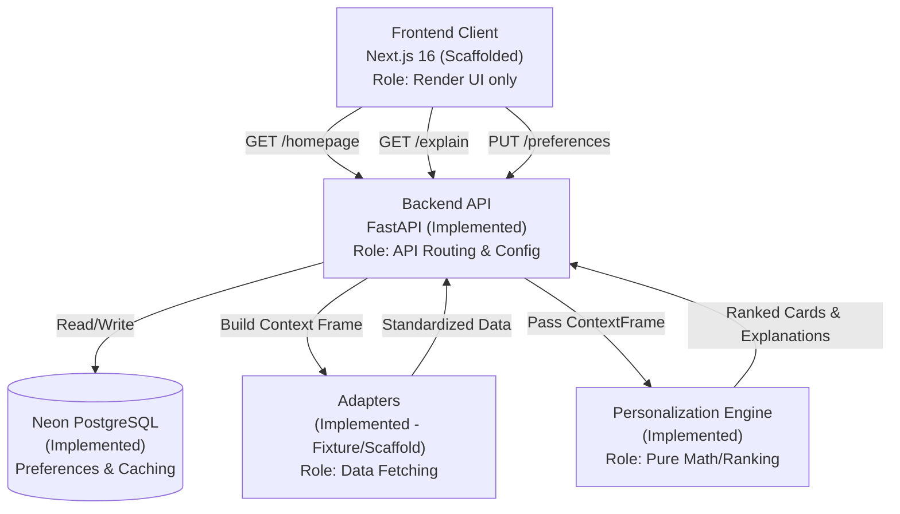

# Technical Architecture

This document describes the high-level architecture of the Mausam Personalized Homepage system.

## 1. High-Level Architecture Diagram

## 2. Component Roles

### Frontend (Next.js 16)
- **Status:** Scaffolded (Pending UI implementation).
- **Role:** Pure presentation layer. It manages local `device_id` generation, fetches data from the API, and renders the ranked cards exactly in the order provided by the backend. It handles UI states like loading, degraded visuals (badges), and settings modal interactions. **It performs zero personalization math.**

### Backend API (FastAPI)
- **Status:** Implemented.
- **Role:** Serves as the orchestrator. Contains routing (`/homepage`, `/explain`, `/preferences`). Handles the assembly of the `ContextFrame` by calling necessary Adapters, executes the Personalization Engine against the frame, formats the results into Pydantic-validated JSON, and temporarily caches explanation metadata. 

### PostgreSQL (Neon + psycopg3)
- **Status:** Implemented.
- **Role:** Safely stores user personas, health flags, and saved locations keyed by `device_id`. Also provides a `signal_cache` table to persist environmental data to prevent 5xx failures if external APIs go down. Note: Replaced original SQLite plans to survive Render ephemeral disk restarts.

### Adapters
- **Status:** Implemented (Fixture/Scaffold mode).
- **Role:** Provide a unified interface (`fetch()`) irrespective of the data source. 
- *Current state:* 
    - `SunAdapter`: Live computational math.
    - `ForecastAdapter`, `WarningAdapter`: Simulated via local JSON fixtures.
    - `AQIAdapter`, `UVAdapter`: HTTP scaffolds prepared, but gracefully catch timeouts and fall back to dummy/unavailable data for MVP.
- *Future state:* Re-wired to point to real IMD/CPCB URLs with proper authentication.

### Personalization Engine
- **Status:** Implemented and Frozen.
- **Role:** A pure, dependency-free Python function. It takes in a `ContextFrame` and exports `EngineOutput` (Ranked Cards + Explanations). It cannot make network calls. It relies exclusively on mathematical scoring arrays and boolean priorities.

## 3. Data Flow: Signal to UI

1. The frontend hits `/homepage`.
2. `backend/deps.py` pulls user preferences from Postgres.
3. `deps.py` maps the user's lat/lon and spins up Adapters to construct a `ContextFrame` (e.g. `uv.value = 8.0, uv.source="simulated"`).
4. `rank()` evaluates the frame. E.g., The "Health" persona has a 0.9 weight for AQI. If AQI is poor, urgency hits 1.8. Total Score = 1.62. 
5. The cards sort mathematically. If a Severe Warning exists, it bypasses math and goes to the `warnings_override` P0 bucket.
6. The engine generates text explanations by injecting signal values into formatted templates.
7. The `/homepage` API wraps this in `HomepageResponse` json.
8. The frontend maps over the `cards[]` array, rendering components from top to bottom.

## 4. Current Technology Stack

| Layer | Technology | Status |
|---|---|---|
| Frontend Framework | Next.js 16 (App Router), React 19 | Scaffold Setup |
| Styling | Tailwind CSS v4 | Setup |
| State/Fetching | TanStack Query v5 | Planned |
| Backend Framework | FastAPI 0.115 | Implemented |
| Data Validation | Pydantic v2 | Implemented |
| Database | PostgreSQL (via Neon) | Implemented |
| DB Driver | psycopg v3 (Connection Pool) | Implemented |
| Astronomy | `astral` | Implemented |
| Testing | pytest | Implemented (147 tests) |
| Deployment (Planned) | Render (Backend), Vercel (Frontend)| Future |
