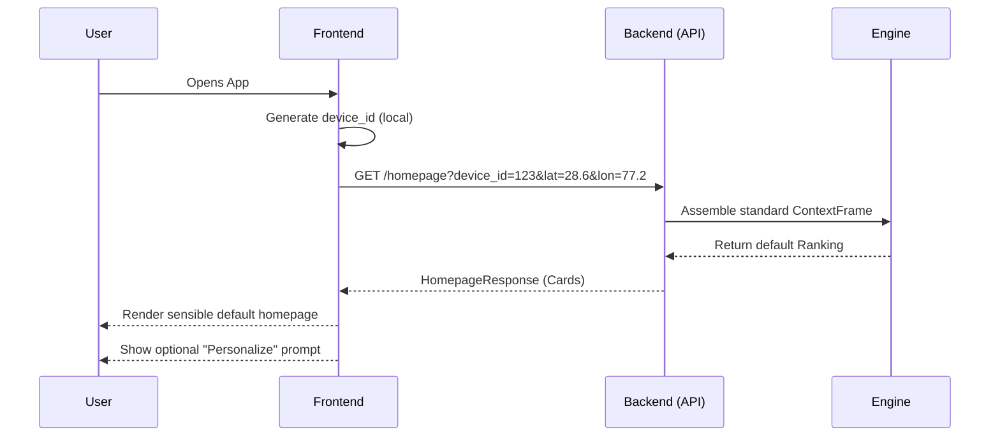
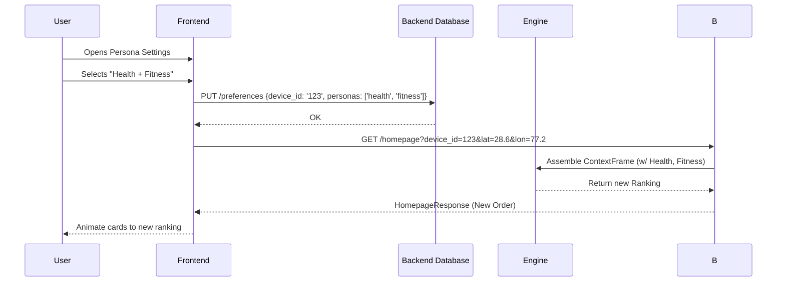
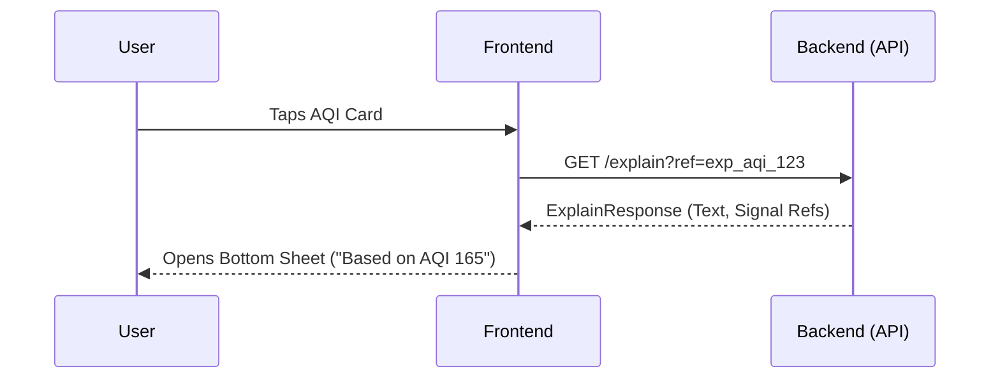
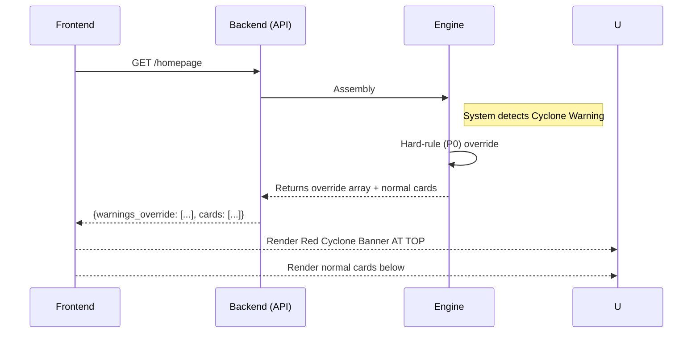
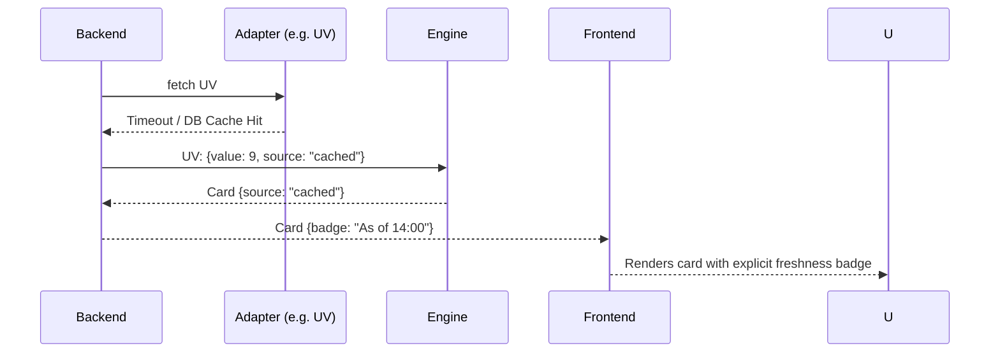

# User Flows

This document outlines the core user journeys for the Mausam Personalized Homepage MVP.

## A. First-Time User Flow (Cold Start)

## B. Preferences Update Flow

## C. Explanation Interaction Flow

## D. Severe Warning Override

## E. Degraded Data Behavior

